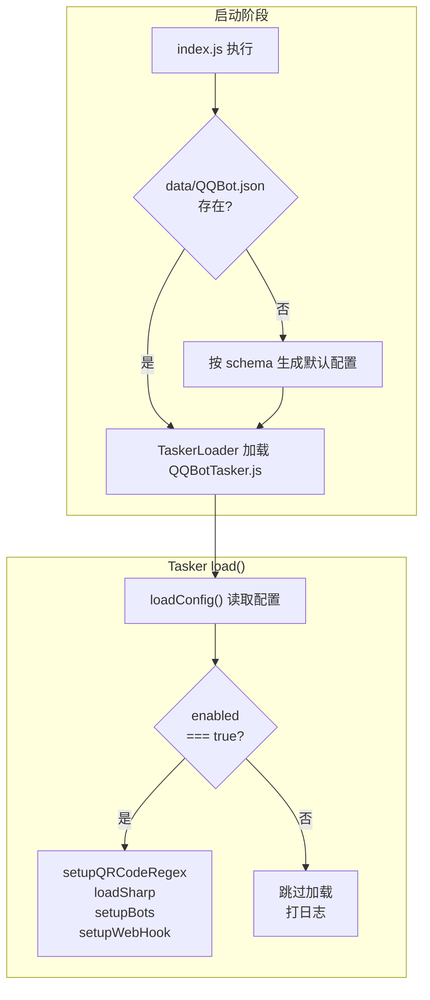
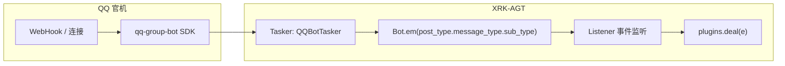
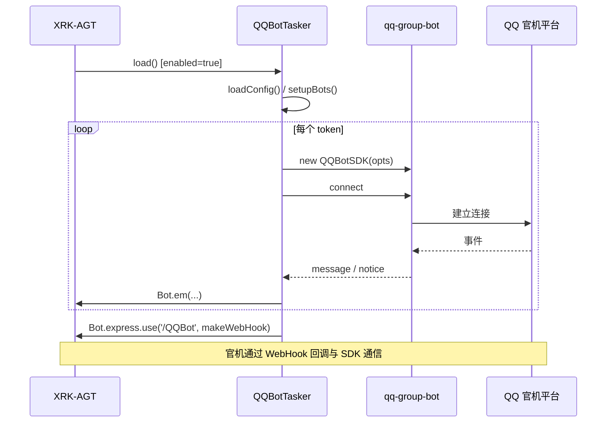

<div align="center">

# 🤖 QQbot-Core

**XRK-AGT QQ 官机通道：基于 qq-group-bot 接入 QQ 群与频道，将消息/通知标准化为 XRK 事件，与插件链无缝对接。**

[](https://github.com/sunflowermm/XRK-AGT)
[](https://www.npmjs.com/package/qq-group-bot)
[](./LICENSE)

</div>

---

## 📦 项目定位

- **所在位置**：在 XRK-AGT 仓库内作为 Core 模块，放入 `core/QQbot-Core/` 即可。
- **职责**：
  - 提供 **QQ 官机事件接入**（Tasker：`QQBotTasker.js`），将 SDK 消息/通知标准化为 `post_type.message_type.sub_type` 等事件。
  - 通过 **commonconfig/qqbot.js** + **data/QQBot.json** 提供启用开关、Token、Bot 连接、Markdown、URL 转二维码等配置。
  - 启动时由 **index.js** 确保配置文件存在；是否真正加载由配置项 **enabled** 控制。

---

## 🗂️ 目录结构

```text
QQbot-Core/
├── README.md
├── LICENSE
├── .gitignore
├── index.js                    # 启动时确保 data/QQBot.json 存在；是否加载由 enabled 控制
├── commonconfig/
│   └── qqbot.js                # 配置 Schema（enabled、Token、Bot、Markdown 等）
└── tasker/
    └── QQBotTasker.js          # Tasker：qq-group-bot SDK → 标准化事件 → Bot.em → 插件链
```

---

## ⚙️ 配置与启用

### 配置文件路径

- **实际生效**：`data/QQBot.json`  
  - 由 `commonconfig/qqbot.js` 的 `filePath` 指定，通过 `global.ConfigManager.get('qqbot')` 获取实例，可在 **Web 控制台** 编辑。
- **首次运行**：若文件不存在，`index.js` 会按 schema 默认值生成一份，无需手写。

### 启用开关

| 字段       | 类型    | 说明 |
|------------|---------|------|
| **enabled** | boolean | 为 `false` 时 Tasker 不加载、不连接官机；默认 `true`。 |

关闭后重启或热加载即可生效，无需删除 Core。

### 主要配置项

| 字段 | 说明 |
|------|------|
| **token** | 数组，每项格式：`id:appid:token:secret:群消息(0/1):频道消息(0/1)` |
| **bot** | 连接参数：sandbox、maxRetry、timeout |
| **toQRCode** | URL 转二维码（boolean / 正则字符串 / 配置对象） |
| **toCallback** | 按钮回调开关 |
| **toBotUpload** | Bot 上传资源开关 |
| **hideGuildRecall** | 隐藏频道撤回 |
| **imageLength** | 图片压缩阈值(MB)，>0 时依赖 sharp |
| **markdown** | Markdown 模板等 |

---

## 🔄 加载与事件链路

### 加载流程（是否启用）



### 事件流（收消息 → 插件）



**事件流说明：**

1. **Tasker**：接收 SDK 的 message/notice → `makeMessage` / `makeNotice` → 标准化 `data`（含 `post_type`、`message_type`、`sub_type`、`self_id`、群/私聊等）→ `Bot.em(\`${post_type}.${message_type}.${sub_type}\`, data)`。
2. **Listener**：订阅上述事件 → 去重、挂载 `e.reply` 等 → `plugins.deal(e)`。
3. **插件**：通过 `plugins.deal` 统一处理；可按 `message_type`（group/private）与 `sub_type` 区分群聊、私聊、频道等。

### 连接与 WebHook 关系



---

## 📋 事件与字段

| 来源 | 事件名示例 | 说明 |
|------|------------|------|
| 消息 | `message.group.normal` / `message.private.friend` 等 | 群聊 / 私聊消息，经 makeMessage 标准化 |
| 通知 | `notice.*` | 群/频道通知，经 makeNotice 标准化 |
| 连接 | `connect.{id}` | 单 Bot 连接成功，仅打日志不进入插件链 |

消息数据中常见字段：`post_type`、`message_type`、`sub_type`、`self_id`、`group_id` / `user_id`、`message`、`raw_message`、`sender` 等，与 OneBot 风格对齐，供插件使用。

---

## 🧱 与 XRK-AGT 框架的关系

本 Core 仅依赖 XRK-AGT 已有能力，不修改基础设施层：

| 能力 | 说明 |
|------|------|
| **commonconfig 加载** | ConfigLoader 扫描 `core/*/commonconfig/*.js`，`qqbot.js` → key `qqbot`，通过 `ConfigManager.get('qqbot')` 访问。 |
| **Tasker 加载** | TaskerLoader 扫描 `core/*/tasker/*.js` 并 import 模块；本 Core 在模块顶层向 `Bot.tasker.push` 注册实例，框架随后对每个 tasker 调用 `load()`。 |
| **index.js 执行** | 插件/核心加载阶段会执行各 Core 根目录的 `index.js`；本 Core 仅用于确保 `data/QQBot.json` 存在。 |
| **全局对象** | 使用 `Bot`、`global.ConfigManager`、`Bot.express` 等，遵循 XRK-AGT 约定。 |

---

## 📦 依赖

- **qq-group-bot**：官机 SDK  
- **qrcode**：URL 转二维码  
- **url-regex-safe**：URL 匹配  
- **silk-wasm**：语音处理  
- 可选 **sharp**：当 `imageLength > 0` 时用于图片压缩  

在项目根或本 Core 目录执行：

```bash
pnpm install
```

---

## 🔗 相关链接

- **XRK-AGT 主项目**：[XRK-AGT](https://github.com/sunflowermm/XRK-AGT)
- **QQ 机器人开放平台**：[QQ 开放平台](https://bot.q.qq.com/)

---

## 📄 许可证

本 Core 采用 **MIT License** 开源，见 [LICENSE](./LICENSE)。若主项目 XRK-AGT 另有约定，以主项目为准。
